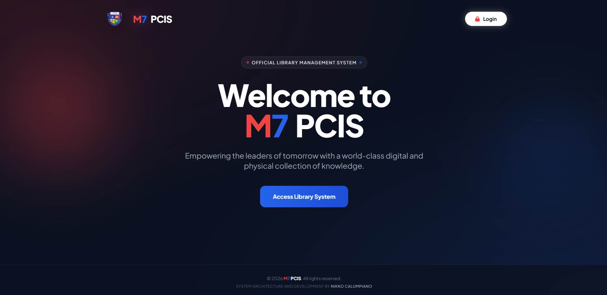
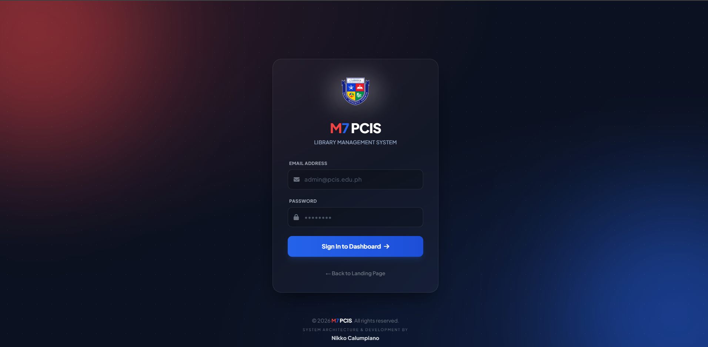
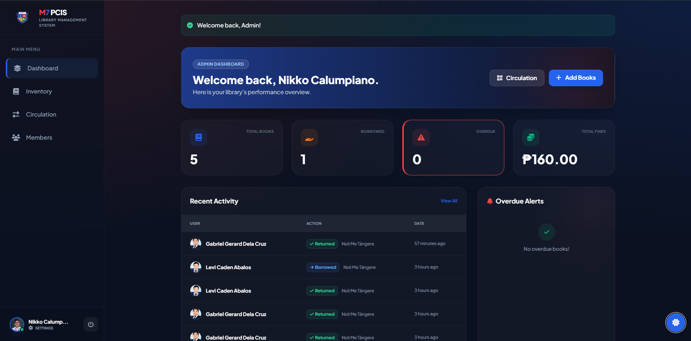
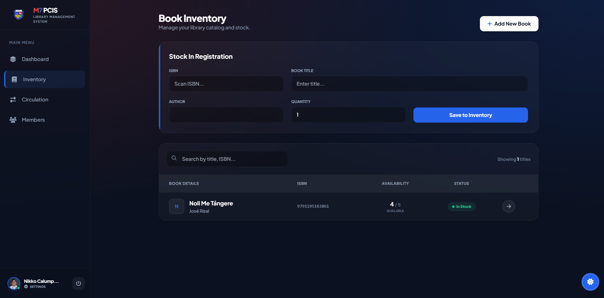
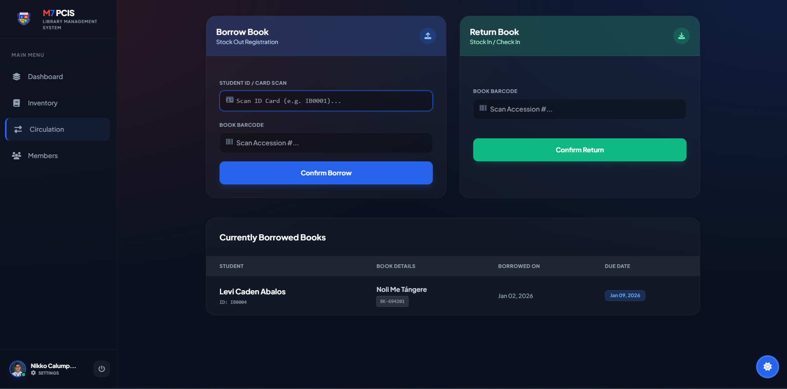
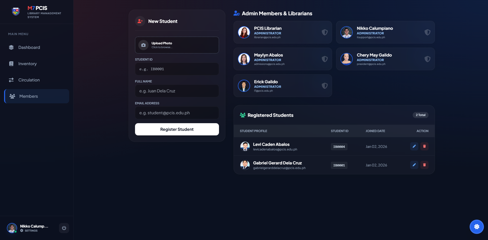

# 📚 M7 PCIS Library Management System

**Version:** 1.0.0  
**Developer:** Nikko Calumpiano  
**Framework:** Laravel 10/11 + Tailwind CSS  

---

## 🚀 Project Overview

The **M7 PCIS Library Management System** is a comprehensive web application designed to streamline library operations for M7 PCIS School. It manages the entire lifecycle of book circulation, student memberships, inventory tracking, and financial reporting (fines).

The system features a **Premium "Glassmorphism" UI** with a fully functional, persistent **Dark/Light Mode** engine.

### 🛠 Technical Stack
*   **Backend:** Laravel Framework (PHP)
*   **Database:** MySQL (via PHPMyAdmin)
*   **Frontend:** Blade Templates, Tailwind CSS (CDN)
*   **Icons:** FontAwesome 6 (Free)
*   **Scripting:** Vanilla JavaScript (Modals, Theme Toggling, AJAX)

---

## 🗄 Database Architecture

The system uses a normalized relational database schema to separate abstract book titles from physical copies.

### 1. `users` Table
Stores both Administrators and Students.
*   `id`: Primary Key.
*   `student_id`: **(Unique)** Official School ID (e.g., `2024-001`). Nullable for Admins.
*   `name`: Full Name.
*   `email`: Email Address.
*   `password`: Hashed Password.
*   `role`: Enum (`'admin'`, `'member'`). Controls access to the dashboard.
*   `avatar`: Path to profile picture (linked to `storage/public/avatars`).

### 2. `books` Table
Stores metadata for book titles.
*   `id`: Primary Key.
*   `isbn`: International Standard Book Number.
*   `title`: Book Title.
*   `author`: Author Name.
*   `publication_year`: Year.

### 3. `book_copies` Table
Represents physical items on the shelf.
*   `id`: Primary Key.
*   `book_id`: Foreign Key (links to `books`).
*   `accession_number`: **(Unique)** Barcode ID (e.g., `BK-82910`).
*   `status`: Enum (`'available'`, `'borrowed'`, `'lost'`).

### 4. `borrow_transactions` Table
Records circulation history.
*   `id`: Primary Key.
*   `user_id`: Foreign Key (Borrower).
*   `book_copy_id`: Foreign Key (Item).
*   `borrowed_at`: DateTime.
*   `due_date`: DateTime (+7 days from borrow).
*   `returned_at`: Nullable DateTime (NULL = Active Loan).
*   `fine_amount`: Decimal (Calculated dynamically or upon return).

---

## 🌟 Core Modules & Features

### 🔐 1. Authentication & RBAC
*   **Middleware Protection:** Custom `IsAdmin` middleware ensures only users with `role='admin'` can access the dashboard.
*   **Custom Login:** Premium split-screen design with glassmorphism effects.
*   **Profile Management:** Admins can update credentials and **upload profile pictures** which reflect globally across the system.

### 📦 2. Inventory Management
*   **Stock In:** Automatically generates unique `book_copies` based on quantity entered.
*   **Catalog View:** Displays "Available vs Total" counts (e.g., "4 / 5").
*   **Drill-Down:** Clicking a book reveals specific copy details and current borrower info.
*   **Edit Modal:** Update Title, Author, or ISBN via a popup modal.

### 🔄 3. Circulation (In/Out)
*   **Borrowing:**
    *   Uses **Student ID** (e.g., `2024-0056`) instead of database ID.
    *   Uses **Barcode/Accession #** for items.
*   **Returning:**
    *   Auto-calculates fines based on `due_date`.
    *   **Fine Logic:** ₱5.00 per day overdue.
    *   Alerts the librarian immediately if a fine needs to be collected upon return.

### 👥 4. Member Management
*   **Separated Views:**
    *   **Top Section:** Grid view for Admins & Librarians.
    *   **Bottom Section:** Table view for Registered Students.
*   **Avatar Logic:** Displays uploaded photo; falls back to Initials (e.g., "NC") if no photo exists.
*   **CRUD:** Full Create, Read, Update, Delete functionality for members.

### 📊 5. Dashboard Command Center
*   **Financials:** Tracks **Total Fines** (Collected + Pending).
*   **Overdue Alerts:** A dedicated sidebar showing specific students who are late and the **exact amount** they owe in real-time.
*   **Recent Activity:** Live feed of the last 5 transactions.

---

## 🎨 UI/UX Design System

The system uses a custom **"M7 Premium"** theme.

### Color Palette
*   **Primary (Blue):** `#2563EB` (Tailwind `blue-600`)
*   **Accent (Red):** `#EF4444` (Tailwind `red-500`)
*   **Dark Mode BG:** `#0B1120` (Midnight Navy)
*   **Light Mode BG:** `#F8FAFC` (Slate 50)

### Dark / Light Mode Engine
*   Uses **CSS Variables** and **LocalStorage** to persist user preference.
*   Includes specific overrides to ensure pale text turns dark in Light Mode for maximum readability.

---

## ⚙️ Installation Guide

Follow these steps to set up the project on a local machine.

### 1. Clone & Install
```bash
git clone <repository-url>
cd library_system
composer install
```
## 📸 System Screenshots    
### Landing Page


### Login Page


### Dashboard (Dark Mode)


### Inventory Management


### Circulation Page


### Members Page
